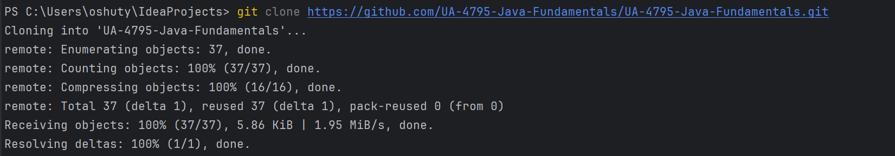
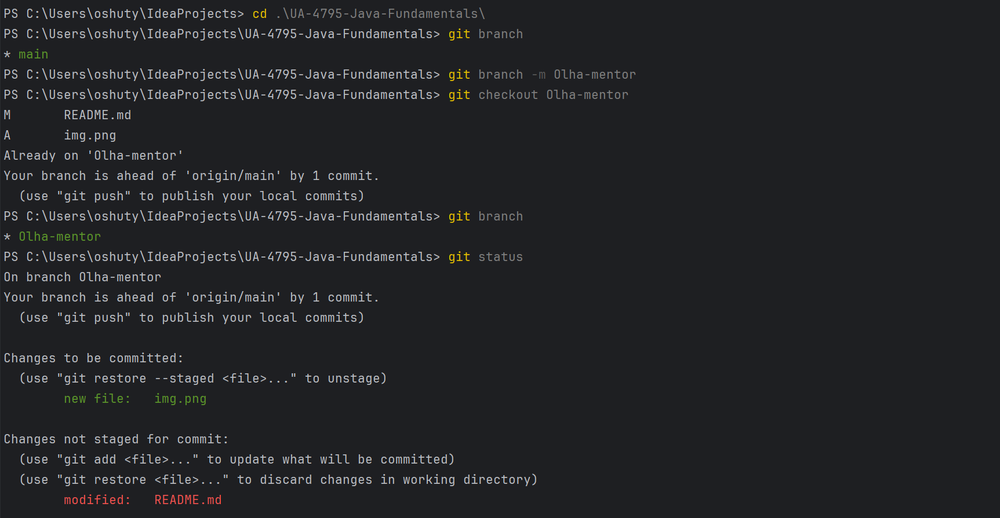
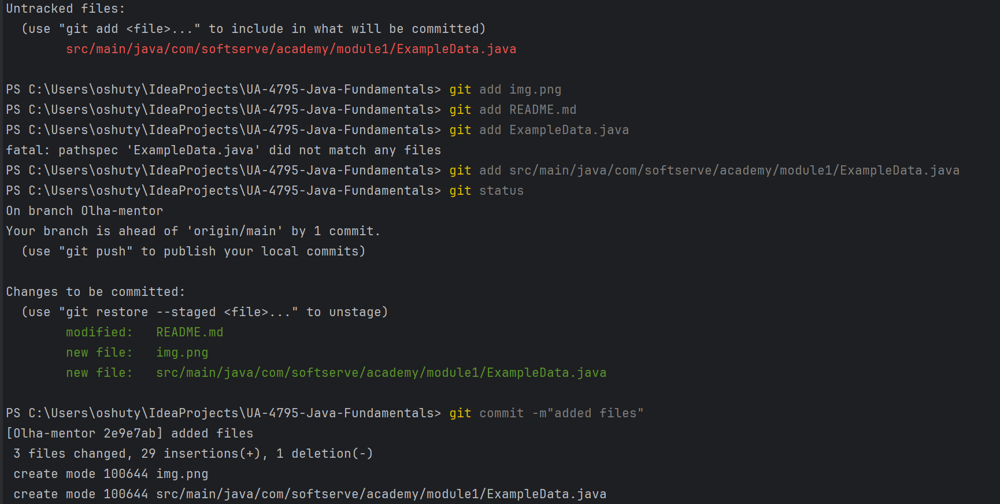
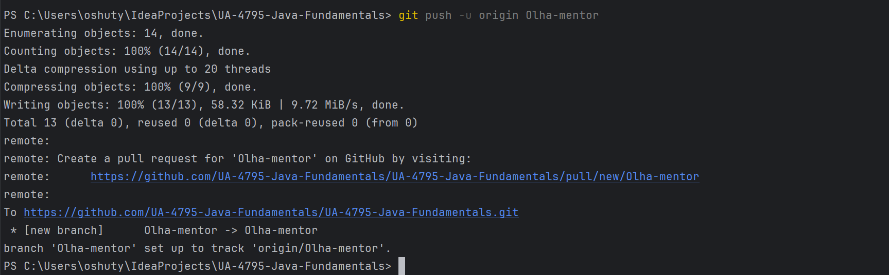

# Java Fundamentals Course 🚀

[](https://www.oracle.com/java/technologies/javase-jdk17-downloads.html)
[](https://maven.apache.org/)
[](https://junit.org/junit5/)

This is the repository for the **UA-4724-Java-Fundamentals** group, created for completing homework and practical tasks for the "Java Fundamentals" course. The course is designed to teach basic Java programming concepts that are essential for further development in the field of software engineering.

## Table of Contents
- [Course Overview](#course-overview)
- [Key Course Topics](#key-course-topics-)
- [Project Structure](#project-structure)
- [Repository Branches](#repository-branches)
- [Getting Started](#getting-started)
    - [Prerequisites](#prerequisites)
    - [Setting Up the Project](#setting-up-the-project)
    - [Running Tests](#running-tests)
- [Contributing](#contributing)

## Course Overview
This course provides a comprehensive introduction to Java programming, covering everything from basic syntax to advanced concepts like multithreading and web development.

## Key Course Topics 📚
1. **Java Introduction**: Overview of Java's capabilities, setting up the environment, and writing your first program.
2. **Version Control Systems (VCS) and GIT**: Basic Git commands and version control principles.
3. **Introduction to Object-Oriented Programming (OOP)**: Basics of OOP, creating classes and objects, and understanding encapsulation.
4. **Condition Statements**: Using `if-else` and `switch` statements for controlling the program flow.
5. **Arrays and Loops**: Operations with arrays and using loops (`for`, `while`, `do-while`) to handle repetitive tasks.
6. **OOP**: A deeper look into OOP, working with methods, and understanding polymorphism, inheritance, interfaces, and abstract classes in Java.
7. **Nested and Inner Classes**: Usage of nested and anonymous classes.
8. **Collections**: An introduction to Java Collections, including `List`, `Set`, and their implementations. Advanced collection types like `Map`, sorting, and searching.
9. **Working with Strings and Regular Expressions**: Manipulating strings and using regular expressions for searching and modifying data.
10. **Exception Handling**: Creating and handling exceptions in Java for writing more reliable code.
11. **Functional Interfaces, Date and Time API**: Using lambda expressions, functional interfaces, and the new Date-Time API.
12. **Streams API**: Parallel and sequential data processing with the Stream API.
13. **Threads**: Basics of multithreading and creating threads in Java.
14. **I/O Streams and Debugging**: Working with input/output streams and basic debugging techniques.
15. **Web Technology**: Introduction to building web applications with Java.

## Project Structure
```
UA-4795-Java-Fundamentals/
├── .mvn/                  # Maven wrapper configuration
├── src/
│   ├── main/java/         # Main source code
│   │   └── com/softserve/academy/module**/
│   │       └── ScannerExample.java
│   └── test/java/         # Test source code
│       └── com/softserve/academy/module**/
│           └── ScannerExampleTest.java
├── .gitignore             # Git ignore file
├── mvnw                   # Maven wrapper script for Unix/Linux
├── mvnw.cmd               # Maven wrapper script for Windows
├── pom.xml                # Maven project configuration
└── README.md              # Project documentation
```

## Repository Branches

- `main` – template for creating new branches
- `Olha-mentor` – examples from training sessions
- `name` – individual student branches (replace "name" with your name)

## Getting Started

### Prerequisites
- Java Development Kit (JDK)  21
- Git
- IDE (IntelliJ IDEA or Eclipse recommended)

### Setting Up the Project

#### How to create a new branch:

1. Create a folder on your local drive 📂
2. Open Command Prompt, Git Bash, or the **terminal** in your IDE (IntelliJ IDEA or Eclipse) 💻
3. Clone the repository 🔗:
    ```bash
    git clone https://github.com/UA-4795-Java-Fundamentals/UA-4795-Java-Fundamentals.git
    ```
4. Navigate to your directory:
    ```bash
    cd UA-4795-Java-Fundamentals
    ```
5. Check the active branch:
    ```bash
    git branch
    ```
6. Create your own branch:
    ```bash
    git branch yourName
    ```
7. Switch to the new branch:
    ```bash
    git checkout yourName
    ```
8. Open the project in your IDE (IntelliJ IDEA or Eclipse) and start writing code.

### Running Tests
This project uses JUnit 5 for testing. To run the tests:

1. Using Maven:
    ```bash
    ./mvnw test
    ```
   or on Windows:
    ```bash
    mvnw.cmd test
    ```

2. Using your IDE:
    - Right-click on the test file or test directory
    - Select "Run Tests" or equivalent option in your IDE

## Contributing
1. Create your feature branch (`git checkout -b feature/amazing-feature`)
2. Commit your changes (`git commit -m 'Add some amazing feature'`)
3. Push to the branch (`git push origin feature/amazing-feature`)
4. Open a Pull Request

---
> **Note**: All the commands above can be run directly from the terminal in your IDE (IntelliJ IDEA or Eclipse) for convenience. ✨





*Screenshot showing the terminal in IntelliJ IDEA*
